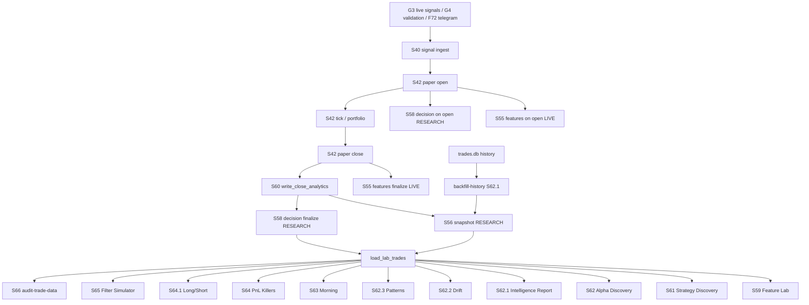

# Trade Data Flow Audit — Phase 2

**Date:** 2026-07-25  
**Scope:** Paper-trade lifecycle in `bot/research/market_events` (+ history backfill from `trades.db`)  
**Constraint:** Documentation only — no application code modified.

**Local environment measured for this audit**

| DB | Path | Role |
|----|------|------|
| LIVE | `data/market_events.db` | signals, paper, S55 features |
| RESEARCH | `data/market_events_research.db` | S56 snapshots, S58 decisions, S59–S66 analytics |
| POLYMARKET | `data/trades.db` | ER / shadow history (backfill source) |

Config: research is a **sibling SQLite** (`separated=True`).

---

## Mermaid — paper analytics spine



---

# 1. Trade lifecycle (stage by stage)

## 1.1 Signal creation (upstream → S40)

| | |
|--|--|
| **Entry point** | `learning-worker` → `run_learning_worker_s40` → `run_learning_pipeline_s40_once` → `ingest_new_s40_signals` |
| **Module** | `signal_intelligence/signal_learning_s40.py` |
| **Functions** | `ingest_new_s40_signals`, `ingest_checkpoints_s40` |
| **Caller** | Supervisor service `learning` (`process_manager.py`); CLI `learning-worker` |
| **Tables read** | `market_live_signals_g3`, `market_events_signal_outcomes_f72`, `market_validation_records_g4` (+ enrich: snapshots, candidates G31/G32, F7) |
| **Tables written** | `market_events_signal_learning_s40_signals` (INSERT OR IGNORE), `…_s40_checkpoints`, `…_s40_ops_state` |
| **Outputs** | New S40 rows with `signal_type ∈ {g3_signal, telegram_signal, validation_signal}` |
| **Downstream** | S42 open |
| **CLI** | `learning-worker`, `learning-status`, `learning-health` |
| **Supervisor** | `learning` |

**Important:** G3 does **not** write S40. G3 writes `market_live_signals_g3` / candidates; learning-worker copies later.

**Note:** `market_validation_signals` (S11) is **not** an S40 source.

---

## 1.2 Paper trade open (S42)

| | |
|--|--|
| **Entry point** | `run_paper_performance_cycle_s42` → `open_paper_trades_from_s40` |
| **Module** | `signal_intelligence/signal_paper_performance_s42.py` |
| **Functions** | `open_paper_trades_from_s40`, `_ensure_account` |
| **Caller** | `run_learning_worker_s40` each cycle; CLI `paper-performance` |
| **Tables read** | `market_events_signal_learning_s40_signals` LEFT JOIN paper (unopened only); open-count; S55 neighbors for gate |
| **Tables written (LIVE)** | `market_events_paper_trades_s42` INSERT OR IGNORE; `market_events_paper_account_s42` |
| **Also calls** | `trade_intelligence_s55.build_entry_features` / `should_open_trade` / `record_trade_features_on_open`; `portfolio_manager_s55.maybe_replace_weakest_for_candidate`; `research_repository_s60.write_open_decision` |
| **Outputs** | Open paper row (`status=OPEN`); gate log; S55 feature row; S58 decision row (research) |
| **Downstream** | Tick / close |
| **CLI** | Via `learning-worker`, `paper-performance` |
| **Supervisor** | `learning` |

---

## 1.3 Feature attribution on open (S55) — LIVE

| | |
|--|--|
| **Entry point** | Called from `open_paper_trades_from_s40` (allowed **and** rejected candidates) |
| **Module** | `signal_intelligence/trade_intelligence_s55.py` |
| **Functions** | `build_entry_features`, `should_open_trade`, `record_trade_features_on_open` |
| **Also** | `market_regime_s57.attach_regime_to_features` / `apply_regime_gate` |
| **Tables read** | `market_snapshots_g3` (funding/OI/ATR/fear/dominance), historical `market_events_trade_features_s55` for similarity |
| **Tables written (LIVE)** | `market_events_trade_features_s55` INSERT OR REPLACE (`features_json` includes S66 attribution: session, strategy, confidence, OI, regime version, …) |
| **Outputs** | Entry feature vector + gate decision + expected PnL estimate |
| **Downstream** | S58 inputs; later S56 snapshot copy on close |
| **CLI** | Indirect only |
| **Supervisor** | Via learning cycle |

**S66 note:** Attribution is intended **at open**, not only after close. Rejected opens still get an S55 row (`paper_trade_id` may be NULL).

---

## 1.4 Decision attribution on open (S58) — RESEARCH

| | |
|--|--|
| **Entry point** | `write_open_decision` after successful S42 INSERT |
| **Module** | `research_repository_s60.write_open_decision` → `decision_trace_s58.record_decision_on_open` |
| **Functions** | `build_why_opened`, `record_decision_on_open`, `_candles_emas` |
| **Tables read** | Live candles for EMAs (via live conn); feature dict in memory |
| **Tables written (RESEARCH)** | `market_events_trade_decisions_s58` (`why_opened_json`, `inputs_json`, EMAs, gate, scores) |
| **Outputs** | Explainable decision row + `entry_reason` stamp (S66) |
| **Downstream** | `load_lab_trades` LEFT JOIN; decision reports |
| **CLI** | `explain`, `decision-report` (read path) |
| **Supervisor** | Via learning cycle |

---

## 1.5 Tick updates (S42 + portfolio)

| | |
|--|--|
| **Entry point** | `run_paper_performance_cycle_s42`: portfolio sweep → open → **tick** → reports |
| **Module** | `signal_paper_performance_s42.tick_open_paper_trades_s42`; `portfolio_manager_s55` |
| **Functions** | `tick_open_paper_trades_s42`, `_activate_trailing_after_tp1`, `sweep_stale_opens`, `enforce_max_open_hard_cap`, `force_close_open` |
| **Tables read** | Open paper trades; live prices (market data helpers) |
| **Tables written (LIVE)** | UPDATE `market_events_paper_trades_s42` (MFE/MAE, trailing stops); may call `_close_trade` |
| **Outputs** | Updated open book; possible closes |
| **Downstream** | Close path |
| **CLI / Supervisor** | learning-worker cycle |

---

## 1.6 Trade close (S42)

| | |
|--|--|
| **Entry point** | `_close_trade` (from tick, trailing, portfolio replace/stale/hard-cap) |
| **Module** | `signal_paper_performance_s42.py` |
| **Functions** | `_close_trade` |
| **Tables written (LIVE)** | UPDATE paper trade (status CLOSED, pnl, exit); UPDATE paper account equity; `finalize_trade_features_on_close` → S55 |
| **Then** | `write_close_analytics(live_conn, trade_row, now)` → RESEARCH |
| **Outputs** | Closed paper row + finalized S55 + research S56/S58 |
| **Downstream** | Analytics via S56 |

---

## 1.7 Snapshot creation (S56) — RESEARCH

| | |
|--|--|
| **Entry point A (live close)** | `write_close_analytics` → `record_close_snapshot` |
| **Entry point B (backfill S42)** | `trade_postmortem_s56.backfill_snapshots` |
| **Entry point C (history)** | `history_backfill_s621.run_history_backfill` → `_upsert_snapshot` |
| **Module** | `trade_postmortem_s56.py`, `history_backfill_s621.py` |
| **Tables read** | Live S55 features (for close path); `trades.db` ER/shadow tables (history) |
| **Tables written (RESEARCH)** | `market_events_trade_snapshots_s56` — UNIQUE `(s40_signal_type, s40_signal_id)` |
| **Write modes** | Close path: INSERT OR REPLACE; History: INSERT OR IGNORE |
| **Outputs** | Closed-trade analytics row + `snapshot_json` (S66 attribution pack) |
| **Downstream** | All `load_lab_trades` consumers |
| **CLI** | `trade-postmortem --backfill`, `backfill-history` |
| **Supervisor** | Indirect on every close via learning |

---

## 1.8 Analytics (S59–S65)

All prefer **research** connection + `load_lab_trades`.

| Stage | Module | CLI | Writes | Reads |
|-------|--------|-----|--------|-------|
| S59 | `feature_lab_s59` | `feature-lab` | feature lab tables (research) | S56/S58/(S55 fallback) |
| S61 | `strategy_discovery_s61` | `strategy-discovery` | discovery tables + optional suggestions | lab trades |
| S62 | `alpha_discovery_s62` | `alpha-discovery` | alpha tables + suggestions | lab trades |
| S62.1 | `trading_intelligence_report_s621` | `intelligence-report` | files under `research/reports/intelligence/` | lab trades |
| S62.2 | `drift_analyzer_s622` | `explain-drift` | drift report files | lab trades |
| S62.3 | `pattern_discovery_s623` | `discover-patterns` | pattern report files | lab trades |
| S63 | `morning_report_s63` | `morning-report` | `research/reports/morning/` | lab + other JSON |
| S64 | `pnl_killers_s64` | `pnl-killers` | `research/reports/pnl/` | lab trades |
| S64.1 | `long_short_analysis_s641` | `long-short-analysis` | pnl reports | lab trades |
| S65 | `filter_simulator_s65` | `simulate-filters` | pnl reports | lab trades |

---

## 1.9 Reports / audits (S66)

| | |
|--|--|
| **Entry point** | CLI `audit-trade-data` |
| **Module** | `trade_data_audit_s66.run_trade_data_audit` |
| **Query path** | See § Discrepancy investigation |
| **Outputs** | `research/reports/pnl/data_quality.{md,json}` |
| **Supervisor** | None (manual) |

---

## Learning-worker cycle order (exact)

```
apply_migrations (startup once on LIVE)
loop:
  1. run_learning_pipeline_s40_once   # ingest S40 + checkpoints
  2. run_learning_reviews_s40_once    # Claude reviews (bounded)
  3. run_paper_performance_cycle_s42
       a. sweep_stale_opens / hard_cap
       b. open_paper_trades_from_s40
       c. tick_open_paper_trades_s42
       d. maybe_emit_scheduled_reports_s42
  4. maybe_emit_daily_performance_s43
  5. persist worker ops + sleep
```

---

# 2. Database ownership

## 2.1 LIVE — `data/market_events.db`

| Table | Owner / purpose |
|-------|-----------------|
| `market_live_signals_g3`, `market_candidate_g31`, … | G3 runtime |
| `market_events_signal_learning_s40_*` | S40 learning |
| `market_events_paper_trades_s42` | **Paper book SoT** |
| `market_events_paper_account_s42` / reports / ops | Paper equity & ops |
| `market_events_trade_features_s55` | Open-time features SoT |
| G3/F7/news/… | Collectors / intel |

Research tables S56–S62 are **not** applied on live (post-v65 policy).

## 2.2 RESEARCH — `data/market_events_research.db`

| Table | Owner / purpose |
|-------|-----------------|
| `market_events_trade_snapshots_s56` | Closed analytics copy (+ history backfill) |
| `market_events_trade_decisions_s58` | Decision traces |
| `market_events_feature_lab_*` / strategy / alpha | Offline discovery |
| postmortem / regime / suggestions | RCA & regime offline |

## 2.3 POLYMARKET — `data/trades.db`

| Tables | Role in this flow |
|--------|-------------------|
| `early_reversion_v*_trades`, `v4_shadow_trades`, `yes_c_shadow_trades`, `virtual_trades`, … | **History backfill sources** → S56 as `hist:*` |

---

# 3. Source of truth

| Concern | Source of truth | Can regenerate? |
|---------|-----------------|-----------------|
| Which paper trades are/were open | **S42 LIVE** | No (operational ledger) |
| Entry features at open | **S55 LIVE** (`features_json`) | Partially (rebuild from g3/S40 imperfect) |
| Why opened / gate / EMAs | **S58 RESEARCH** | Partially (needs open-time inputs) |
| Closed analytics for reports | **S56 RESEARCH** | Yes from S42+S55 (backfill) or history |
| PnL of paper book | **S42** (`pnl_usd`) | Derived at close; authoritative for paper |
| Historical ER performance | **`trades.db`** | No (legacy) — mirrored into S56 via backfill |
| Lab / discovery metrics | Derived from S56 | Yes — recompute anytime |

**Rule of thumb**

- **Operational truth** = LIVE S42 (+ S55).  
- **Analytical truth for S59–S66** = RESEARCH S56 (may be a **superset** of S42 via history).

---

# 4. Duplicate writes

| Duplicate | Detail |
|-----------|--------|
| Features in two places | S55 columns + `features_json`; copied again into S56 columns + `snapshot_json` on close |
| Decision vs features | Overlapping fields (funding, AI, regime, ATR) on S55 and S58 |
| Snapshot writers (3) | Live close `INSERT OR REPLACE`; S56 `backfill_snapshots`; history `INSERT OR IGNORE` |
| PnL stored thrice | S42 close, S55 finalize, S56 snapshot |
| Gate/estimate | Logged in S55 (`gate_*`) and S58 (`gate_result` / why_opened) |
| Regime | Attached on open into S55; may be backfilled later on S55/S56 by S57 |

---

# 5. Duplicate reads

| Consumer pattern | Detail |
|------------------|--------|
| Shared loader | Almost all S59–S66 use `load_lab_trades` (good) |
| Parallel ranking | Coin/hour/direction/regime ranking reimplemented in S62.1, S63, S64, S64.1, postmortem |
| Parallel PF/WR math | Multiple `*_metrics` helpers (S56/S57/S59/S62.x/S64) |
| Paper vs analytics | `paper-performance` reads S42 LIVE; `pnl-killers` reads S56 RESEARCH — **different universes** |

---

# Investigation: `audit-trade-data` count vs `paper_trades_s42`

## Exact query path for `audit-trade-data`

```
CLI audit-trade-data
  → research_connection()          # RESEARCH DB (sibling sqlite by default)
  → run_trade_data_audit(conn)
      → load_lab_trades(conn)
      → keep rows where pnl_usd IS NOT NULL
      → n_trades = len(closed)
```

### `load_lab_trades` primary SQL (research conn)

```sql
SELECT s.*, d.ema20 AS s58_ema20, d.ema50 AS s58_ema50, d.ema200 AS s58_ema200,
       d.rsi AS s58_rsi, d.btc_return AS s58_btc_return
FROM market_events_trade_snapshots_s56 s
LEFT JOIN market_events_trade_decisions_s58 d
  ON d.paper_trade_id = s.paper_trade_id
WHERE s.pnl_usd IS NOT NULL
```

Fallback if empty: `market_events_trade_features_s55 WHERE pnl_usd IS NOT NULL AND result IS NOT NULL`  
(on **whatever DB the connection points to** — normally research, where S55 usually does not live).

### What it does **not** read

- Does **not** query `market_events_paper_trades_s42`
- Does **not** open LIVE DB unless research URL is shared with live (Postgres shared mode)

## Why counts differ (28322 vs 22608 pattern)

| Factor | Effect |
|--------|--------|
| **Different databases** | Audit → RESEARCH S56; S42 → LIVE paper book |
| **History backfill** | `backfill-history` imports `trades.db` ER/shadow rows into S56 as `hist:*` **without** creating S42 rows |
| **Population semantics** | S56 = closed analytics snapshots; S42 = full paper ledger (OPEN + CLOSED + rejects never opened) |
| **Identity key** | S56 UNIQUE `(s40_signal_type, s40_signal_id)` — can hold many hist series; S42 UNIQUE also on S40 pair but only for real paper opens |
| **Stale / additive research** | S56 grows via close + backfill; deleting S42 rows does not delete S56 |
| **Open trades** | Present in S42, absent from audit (no `pnl_usd` snapshot yet) |
| **Rejected S55-only rows** | Can exist on LIVE S55 without S42; not counted by audit unless fallback hits S55 on that conn |

### Local machine evidence (this workspace)

| Metric | Value |
|--------|-------|
| `audit-trade-data` / `load_lab_trades` | **1786** |
| S56 rows (`pnl_usd IS NOT NULL`) | **1786** |
| Distinct S56 `paper_trade_id` | **803** |
| S56 `s40_signal_type` mix | `hist:er_v2` 513, `hist:er_v1` 493, `hist:er_v3` 282, `hist:er_v25` 221, shadows/virtual … |
| LIVE `market_events_paper_trades_s42` | **0** |
| LIVE S55 / S40 | **0** |

**Conclusion (local):** audit count is **100% history-backfilled RESEARCH snapshots**, not the paper book. S42 is empty here → extreme form of the same discrepancy users see when S56 ≫ S42.

**Conclusion (general for 28322 vs 22608):**  
If audit > S42, RESEARCH S56 almost certainly contains **extra hist/backfill (and possibly older closes)** beyond the current LIVE paper ledger. Multiple DBs are involved (`*_research.db` vs live). Research is **not merged into** S42; analytics **ignore** S42 unless a specific paper CLI is used.

### How to verify on any machine

```bash
# Research / audit universe
python -m bot.research.market_events audit-trade-data

sqlite3 data/market_events_research.db \
  "SELECT COUNT(*) FROM market_events_trade_snapshots_s56 WHERE pnl_usd IS NOT NULL;"
sqlite3 data/market_events_research.db \
  "SELECT s40_signal_type, COUNT(*) FROM market_events_trade_snapshots_s56 GROUP BY 1 ORDER BY 2 DESC;"

# Live paper book
sqlite3 data/market_events.db \
  "SELECT COUNT(*) FROM market_events_paper_trades_s42;"
sqlite3 data/market_events.db \
  "SELECT status, COUNT(*) FROM market_events_paper_trades_s42 GROUP BY status;"
```

---

# Final sections

## 1. Trade lifecycle

Upstream signals (G3/G4/F72) → **S40 ingest** → **S42 open** (gate S55/S57) → **S55 features + S58 decision** → **tick/portfolio** → **S42 close** → **S55 finalize + S60 close analytics (S56+S58)** → **`load_lab_trades`** → **S59–S66 reports**.  
Parallel: **`trades.db` → backfill-history → S56** (no S42).

## 2. Database ownership

- **LIVE** owns operational paper + open features.  
- **RESEARCH** owns closed analytics + discovery.  
- **`trades.db`** owns legacy Polymarket history used only as backfill feedstock.

## 3. Source of truth

- Paper positions/PnL ledger: **S42 LIVE**.  
- Reportable closed-trade feature matrix: **S56 RESEARCH** (superset possible).  
- Do not treat audit `n_trades` as “number of paper trades.”

## 4. Duplicate writes

Features/PnL/regime/gate duplicated across S55, S58, S56; three snapshot ingestion paths; history vs live close semantics differ (IGNORE vs REPLACE).

## 5. Duplicate reads

Shared `load_lab_trades` is good; metric/ranking logic is copy-pasted across S62–S65; paper CLIs vs analytics CLIs read different DBs silently.

## 6. Safe consolidation opportunities

| Opportunity | Risk |
|-------------|------|
| Document/enforce “paper count” vs “lab count” in CLI output | Low |
| Tag S56 rows with `provenance` (`live_close` \| `s42_backfill` \| `hist_backfill`) | Low–med |
| Single shared metrics helper for PF/WR/DD | Low |
| One snapshot writer API with explicit mode | Med |
| Optional audit mode: count S42 LIVE vs S56 RESEARCH side-by-side | Low |
| Filter `load_lab_trades` to exclude `hist:*` when analyzing paper-only | Med (behavior change — Phase 3+) |

## 7. Risks

| Risk | Severity |
|------|----------|
| Operators confuse audit/S64 counts with paper book size | **High** |
| History backfill dominates research DB → “PnL killers” describe ER history, not current paper strategy | **High** |
| Dual DB split forgotten when debugging “missing features” | **High** |
| `INSERT OR REPLACE` on close can overwrite a hist row if keys collide | **Med** |
| Rejected opens leave S55 rows without S42 — incomplete attribution audits if someone points at LIVE | **Med** |
| S58 join on `paper_trade_id` weak for hist rows (IDs recycled / non-unique across sources) | **Med** |
| Postgres shared mode (`separated=False`) blurs live/research — different ops failure modes | **Med** |

---

## Appendix — Stage cheat sheet

| Stage | DB | Write moment | Primary table |
|-------|----|--------------|---------------|
| S40 | LIVE | learning ingest | `…_s40_signals` |
| S42 | LIVE | open/tick/close | `…_paper_trades_s42` |
| S55 | LIVE | open + close finalize | `…_trade_features_s55` |
| S58 | RESEARCH | open + close finalize | `…_trade_decisions_s58` |
| S56 | RESEARCH | close / backfill / history | `…_trade_snapshots_s56` |
| S59–S66 | RESEARCH (+ files) | offline CLI | lab tables / `research/reports/**` |

---

*End of Phase 2 Trade Data Flow Audit. No application code was modified.*
